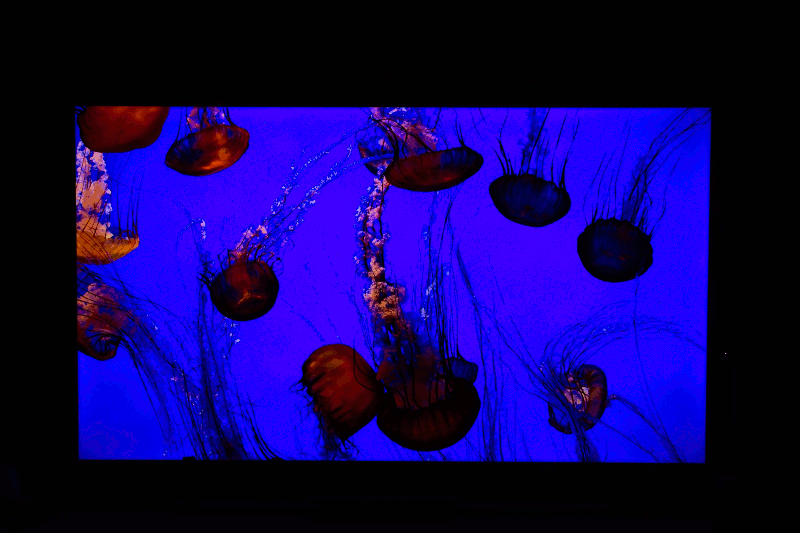

# Arduino Based Ambient Lighting

## Synopsis

After buying a new TV set, I started missing the Ambilight feature of the previous Philips TV.

Doing some research on how to possibly replace it, I've had the idea of combining existing components - hardware and software - to create something similar for this purpose. Controlled by an Arduino, a RGB sensor placed in front of the TV picture will detect the color of a particular area of the screen, which will then be used to set the color of an entire NeoPixel strip, resulting in a constantly adapting ambient lighting.

## Required components

- Arduino
- TCS34725 RGB sensor
- NeoPixel strip (WS2812), length depending on the size of your TV
- 300 to 500 Ohm resistor
- capacitor (1000 µF, 6.3V or higher)
- Wires
- Power supplies (5V for NeoPixel, ~ 9V for Arduino)

## How to assemble

There are already detailed tutorials on how to wire the NeoPixels, as well as for the TCS34725.

For the NeoPixels, there's the so-called [Überguide](https://learn.adafruit.com/adafruit-neopixel-uberguide/) at Adafruit.
Also on Adafruit you may find an extensive guide for wiring the [TCS34725](https://learn.adafruit.com/adafruit-color-sensors/).

I suggest to first test both components individually as described in the above mentioned tutorials, before proceeding to combine them.

For mounting to the screen, I've built a wooden frame which is in size a bit smaller than the actual TV set and attached the LED strips with cable ties to it. Also I've disabled the TCS34725 internal LED, as the TV picture is bright enough.

## The sketch

The sketch, *arduino_ambient_lighting.ino*, is straight forward. After initialization, first the `measureColor` routine is called to determine the current screen color.

To achieve best results, it will measure multiple times (configurable) and calculate the average. Before returning the RGB values will be transformed to have a maximum of 255 - which is the maximum for the NeoPixel strip per color.

The `colorTransition` method will set the NeoPixels to the new, measured color. To make it more smooth, it goes through several steps before reaching the final color.

Finally, before starting over, the current color is stored for the next transition in the `oldColor` variable.

### Configuration

For customization, there are multiple configuration parameters (macros), which will be addressed here shortly.

| Macro | Description |
| ----- | ----------- |
| PIN | The Arduino pin, the NeoPixel data bus is connected to |
| NUMPIXELS | Number of LEDs on your NeoPixel strip |
| DEBUG | Turn DEBUG mode on/off (1/0), in debug mode you'll see some useful output on the serial console
| LED | The Arduino internal LED pin |
| NUMAVG | Amount of measurements in the `measureColor` method, to determine the actual color to set |
| DELAYMEASURE | Delay (in milliseconds) between individual color measurements |
| DELAYCHANGE | Delay (again in milliseconds) between color transitions |
| SMOOTH | number of intermediate steps between old and new color |
| (R/G/B)_FACTOR | factors per color; I liked to reduce the blueish part a bit; **must** be equal or less than 1 |

## Example pictures

Here are some example photos of my setup in action, showing with ambient lighting turned off and on.

The TCS34725 is placed on the lower left corner of the TV.

## Pitfalls

Of course, this solution won't replace a proper Ambilight TV or Kodi based solutions. But, in comparison to similar Ambilight clones, this approach will work with all kind of TV input  sources.

Also, since it (currently) only supports a single RGB sensor, the color of the ambient light is strictly limited to what this sensor "sees". This frequently results in white and blue colors.

If there's a certain color just in the single spot the sensor measures, the whole LED strip
will be set to this color.

## Extensions

Please feel free to submit improvements, fixes or extensions.

For instance, one idea would be to support multiple TCS34725 for placing one to the left, one to the right, or even one in every corner of the TV screen.
